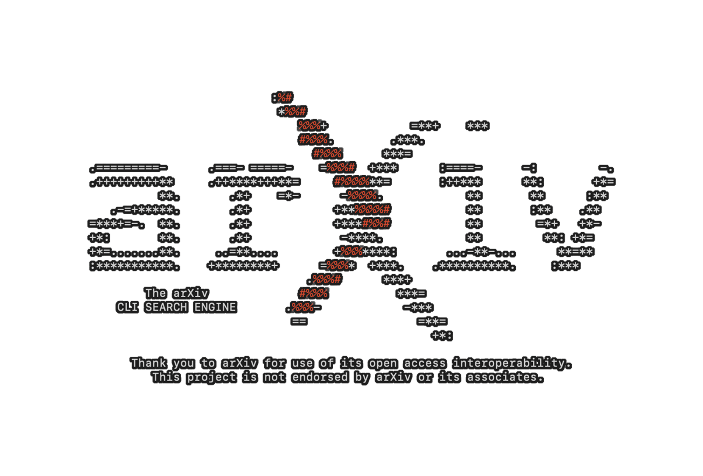

# arXiv CLI Search

`arxiv_cli_search` is a Python-based command-line interface (CLI) tool designed to help researchers and enthusiasts search for academic papers on arXiv, manage a personal library of interesting articles, and bulk download PDFs.

## Features

*   **Modular Architecture:** Organized into a clean, maintainable structure with dedicated modules for API interaction, library management, downloading, and display utilities.
*   **Interactive Menu:** A user-friendly, menu-driven interface for seamless navigation.
*   **Consistent Exit Option:** The program can be exited gracefully from any menu by typing `exit` or `exit arxiv searcher`.
*   **Enhanced Visuals:** Features a custom, colored ASCII art arXiv logo at startup and animated loading indicators during API calls, powered by the `rich` library.
*   **Paper Search:** Search arXiv by keywords with optional date range filtering.
*   **"I'm Feeling Lucky" Option:** Discover random papers with a single command.
*   **Expand Functionality:** Dive deeper into a paper by expanding on it to find related articles based on its keywords. This creates a new search context for exploration.
*   **Personal Library:** Build and manage a local collection of papers.
    *   Add papers from search results.
    *   View saved papers.
    *   Filter library by keywords (title, authors, summary).
    *   Sort library by publication date, title, or authors.
    *   Remove papers from the library.
*   **PDF Download:** Download individual paper PDFs.
*   **Bulk Download:** Download all papers from your current filtered/sorted library view with a 3-second delay between downloads to respect arXiv API terms.
*   **Detailed Paper View:** Display comprehensive details for any selected paper, including abstract and PDF URL.

## Installation

1.  **Clone the repository (or download the project files):**
    ```bash
    git clone <repository_url>
    cd arxiv_cli_search
    ```
    *(Note: Replace `<repository_url>` with the actual URL if this project is hosted on Git.)*

2.  **Install dependencies:**
    ```bash
    pip install -r requirements.txt
    ```

## Usage

To run the arXiv CLI Search, execute the `run.py` script from the project's root directory:

```bash
python run.py
```

The program will present you with a main menu, starting with a visually enhanced arXiv logo:

```
# (Your new ASCII art logo will appear here)

--- arXiv CLI Search ---
1. Search Papers
2. View Library
3. I'm Feeling Lucky
4. Exit arXiv Searcher
Enter your choice: 
```

### Navigating the Menus

You can interact with the menus by entering the corresponding number or a relevant keyword (e.g., `1` or `search`, `2` or `library`, `3` or `lucky`, `4` or `exit` or `exit arxiv searcher`).

### Search Papers

When searching, you'll be prompted for a query and can optionally specify a date range (YYYY-MM-DD). A loading animation will be displayed during the search.

### View Library

In the library view, you can:
*   Enter a paper number to view its details and perform actions (download, add/remove).
*   `filter` (or `2`): Filter the displayed papers by a keyword.
*   `sort` (or `3`): Sort the displayed papers by `published`, `title`, or `authors` in `asc` (ascending) or `desc` (descending) order.
*   `reset` (or `4`): Clear any active filters or sorting and show all papers in your library.
*   `bulk download` (or `5`): Download all papers currently displayed in your filtered/sorted view.
*   `b` (or `back`): Return to the main menu.
*   `exit` (or `exit arxiv searcher`): Exit the program.

### Paper Actions

After selecting a paper from search results or your library, you can:
*   `download` (or `1`): Download the PDF to the `data/downloads/` directory.
*   `add to library` (or `2`): Add the paper to your `library.json` (if not already there).
*   `remove from library` (or `2`): Remove the paper from your `library.json` (if it's a library paper).
*   `expand` (or `e`): Find and display related papers based on the selected paper's keywords.
*   `b` (or `back`): Return to the previous list.
*   `exit` (or `exit arxiv searcher`): Exit the program.

## Data Storage

*   **`library.json`:** Your saved papers are stored in `data/library.json`.
*   **`downloads/`:** Downloaded PDFs are saved in `data/downloads/`.

## Project Structure

```
arxiv_cli_search/
├── run.py                  # Top-level entry point
├── requirements.txt        # Project dependencies
├── README.md               # This file
└── src/
    ├── __init__.py         # Python package marker
    ├── arxiv_api.py        # Handles arXiv API requests and parsing
    ├── library_manager.py  # Manages loading, saving, filtering, and sorting the paper library
    ├── downloader.py       # Handles PDF downloading
    ├── display_utils/      # Contains display-related utilities
    │   ├── __init__.py     # Python package marker
    │   └── logo/           # Contains logo-related assets
    │       └── logo_art.py # ASCII art logo definition and rendering
    └── cli/
        ├── __init__.py     # Python package marker
        └── main.py         # Main CLI logic and user interaction
```

## License

This project is open-source and available under the [MIT License](LICENSE).
